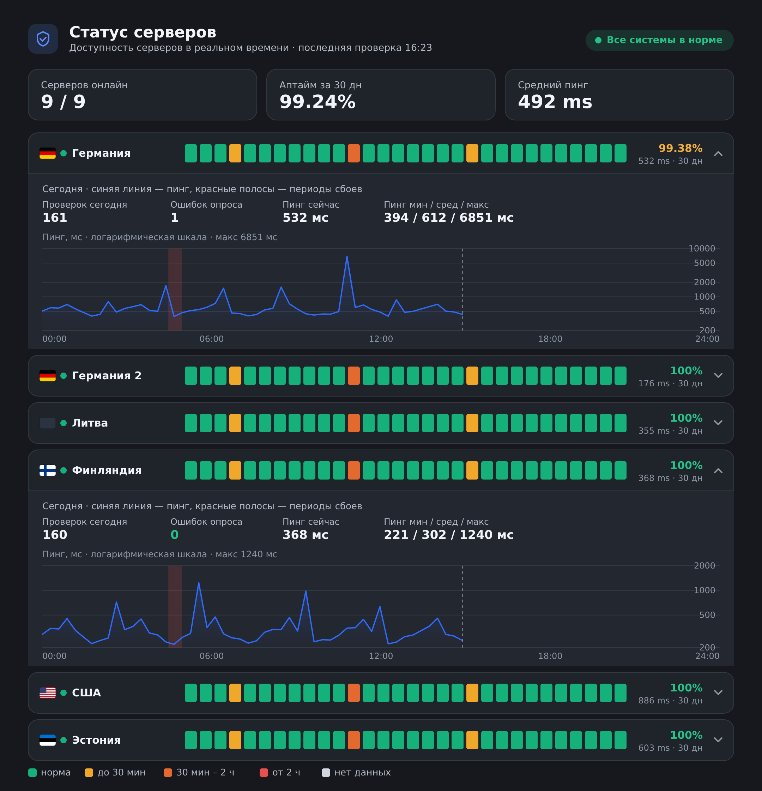

# Кастомный статус-пейдж для xray-checker

`xray-checker-statuspage` — современная страница статуса VPN/прокси-серверов поверх
[xray-checker](https://github.com/kutovoys/xray-checker).

> **Спасибо [kutovoys](https://github.com/kutovoys)** — автору
> [xray-checker](https://github.com/kutovoys/xray-checker): отличный инструмент, который делает
> всю реальную работу по проверке прокси. Этот проект лишь рисует поверх него страницу статуса
> и использует **официальный образ** `kutovoys/xray-checker`.

Строка на каждый сервер, шкала аптайма за 30 дней с флагами стран; наведение на день —
дата, аптайм и длительность простоя. Клик по любому дню раскрывает детализацию: график пинга
на логарифмической шкале (норма и редкие всплески видны одновременно, значение линии всегда
совпадает с подсказкой) и периоды сбоев красными полосами.
Активное окно 12 часов с прокруткой, «сейчас» по центру. Тёмная/светлая тема, шрифт Inter с
кириллицей (локально), своё лого и favicon.

Чат и поддержка: https://t.me/+O5jAhwcYdYhlY2Yy



```
xray-checker  →  реально тестит прокси через Xray (порт 2112, внутренний)
statuspage    →  опрашивает checker, копит историю в SQLite, рисует страницу (порт 8080)
```

## Возможности

- Аптайм за 30 дней по каждому серверу, флаги стран, общий простой.
- Детализация дня: график пинга (лог. шкала), периоды сбоев, статистика проверок.
- «Подтверждённый» расчёт простоя (одиночный блип не считается за целый интервал).
- Тёмная/светлая тема (кнопка + по системной), плавные анимации, адаптив под мобильные.
- Своё название, лого и favicon; история в SQLite (лёгкая, авто-очистка).
- Анти-фингерпринт: рандомизация классов и маскировка Server-заголовка.

## Установка

Нужны Ubuntu/Debian и root. Установщик сам поставит Docker при необходимости.

Образ собирается автоматически в GitHub Actions и публикуется в GHCR
(`ghcr.io/mrvibecodic/xray-checker-statuspage`), а сервер только **тянет готовый образ** — без
локальной сборки и без клонирования репозитория. Рабочую папку `/opt/xray-checker-statuspage`
и `data/` создаёт сам установщик; вручную создавать ничего не нужно.

> **Важно: отключите HWID у сервисного пользователя.** Учётка, чью ссылку подписки вы укажете
> в `SUBSCRIPTION_URL`, должна быть **без ограничения HWID** (лимита устройств). xray-checker
> отправляет собственные HWID-заголовки, и если на этом пользователе включён HWID, панель в ответ
> отдаёт заглушку вместо списка серверов, а чекер падает с ошибкой
> `Error initializing configuration: no valid proxy configurations found`. В карточке этого
> пользователя в панели выключите HWID (или заведите отдельного служебного юзера без лимита устройств).

### Вариант A. Чистый сервер (установщик сам поставит nginx + HTTPS)

```bash
curl -fsSL https://raw.githubusercontent.com/Mrvibecodic/xray-checker-statuspage/main/install.sh -o install.sh
sudo bash install.sh
```

На вопрос про nginx отвечаешь «да» и вводишь домен. nginx ставится из официального
репозитория **nginx.org** (только если его ещё нет). Сертификат HTTPS обязателен, на выбор:

- **HTTP-01** — проверка по 80 порту (порт открыт извне);
- **Cloudflare DNS** — без открытия порта; API Token (`Zone.DNS: Edit`) или Global API Key + email.

### Вариант B. Сервер с панелью или уже установленным nginx

На вопрос про nginx отвечаешь «нет» — сервис поднимется на `http://127.0.0.1:8080`, проксирует панель/твой nginx.

```bash
curl -fsSL https://raw.githubusercontent.com/Mrvibecodic/xray-checker-statuspage/main/install.sh -o install.sh
sudo bash install.sh
```

- **Панель (FastPanel/ISPmanager):** сайт на домене → обратный прокси на `http://127.0.0.1:8080`, сертификат средствами панели. HTTP-авторизацию на сайте выключи.
- **Готовый nginx:** server-блок (замени домен):

  ```nginx
  server {
      listen 80;
      server_name status.your-domain.example;
      location / {
          proxy_pass http://127.0.0.1:8080;
          proxy_set_header Host $host;
          proxy_set_header X-Real-IP $remote_addr;
          proxy_set_header X-Forwarded-For $proxy_add_x_forwarded_for;
          proxy_set_header X-Forwarded-Proto $scheme;
      }
  }
  ```

  ```bash
  ln -s /etc/nginx/sites-available/status.conf /etc/nginx/sites-enabled/
  nginx -t && systemctl reload nginx
  certbot --nginx -d status.your-domain.example
  ```

### Вариант C. Вручную, без скрипта

```bash
mkdir -p /opt/xray-checker-statuspage && cd /opt/xray-checker-statuspage
curl -fsSL https://raw.githubusercontent.com/Mrvibecodic/xray-checker-statuspage/main/docker-compose.example.yml -o docker-compose.yml
nano docker-compose.yml
docker compose pull && docker compose up -d
```

## Обновление

```bash
cd /opt/xray-checker-statuspage && docker compose pull && docker compose up -d
```

Либо повторно `sudo bash install.sh` → «не перенастраивать»: обновит образ и перезапустит, настройки сохранятся.

## Обновление подписки (новый сервер)

Вручную ничего не нужно. xray-checker перечитывает подписку каждые `SUBSCRIPTION_UPDATE_INTERVAL`
секунд (по умолчанию 300), страница подхватывает новые серверы за пару минут; история нового
сервера копится с момента появления. Убранный из подписки сервер сам пропадёт.

Если сменил саму ссылку подписки — поправь `SUBSCRIPTION_URL` в `docker-compose.yml` и `docker compose up -d`.

## Кастомизация

Переменные окружения в `docker-compose.yml`. После правки — `docker compose up -d`.

Сервис `statuspage`:

| Переменная | По умолчанию | Описание |
|---|---|---|
| `TITLE` | `Статус серверов` | заголовок в шапке и во вкладке |
| `SUBTITLE` | — | подзаголовок |
| `TZ` | `Europe/Moscow` | часовой пояс дат |
| `DAYS` | `30` | сколько дней истории показывать |
| `POLL_INTERVAL` | `300` | период опроса checker, сек (= `PROXY_CHECK_INTERVAL`) |
| `SAMPLE_RETAIN_DAYS` | `DAYS+1` | сколько дней хранить поминутные данные |
| `SERVER_HEADER` | `nginx` | значение заголовка `Server` (маскировка) |
| `CHECKER_URL` | `http://xray-checker:2112` | адрес xray-checker |
| `DB_PATH` | `/data/status.db` | путь к базе |
| `ADMIN_TOKEN` | — | секрет для админ-режима (удаление серверов со страницы). Пусто — функция выключена. |

Сервис `xray-checker` (основные):

| Переменная | По умолчанию | Описание |
|---|---|---|
| `SUBSCRIPTION_URL` | — | ссылка на подписку (можно несколько через запятую) |
| `PROXY_CHECK_INTERVAL` | `300` | как часто тестируются прокси, сек |
| `PROXY_TIMEOUT` | `30` | таймаут одной проверки, сек |
| `PROXY_CHECK_METHOD` | `ip` | метод: `ip`, `status` (легче), `download` |
| `METRICS_USERNAME` / `METRICS_PASSWORD` | — | Basic Auth админки/метрик checker |

### Логотип и favicon

Положи картинку с именем на `favicon` (`png/svg/ico/jpg/webp`) в папку `data` рядом с
`docker-compose.yml` — подхватится как favicon и лого в шапке. Рекомендуется квадрат (PNG 256×256)
или SVG. Нет файла — дефолтный значок-щит.

### Тема

Светлая/тёмная — кнопка в шапке (выбор сохраняется), по умолчанию по системной настройке.
Цвета простоя: зелёный (нет сбоев), жёлтый (до 30 мин), оранжевый (30 мин – 2 ч), красный (от 2 ч).

### Удаление серверов со страницы

Иногда сервер из подписки тебе уже не интересен (старый, тестовый, временный), а в чекере он
остаётся и продолжает мозолить глаз на странице. Чтобы убрать такой сервер вручную:

1. Задай секрет в `docker-compose.yml`:

   ```yaml
   statuspage:
     environment:
       - ADMIN_TOKEN=придумай-длинный-секрет
   ```

   и перезапусти: `docker compose up -d`.

2. Открой страницу — в шапке появится **иконка-замок** рядом со сменой темы. Нажми на неё,
   введи токен. Токен запомнится в `localStorage` браузера; повторный ввод не нужен.

3. В режиме админа справа от каждой строки сервера появится кнопка **×** — клик → подтверждение
   → сервер пропадает со страницы. Его накопленная статистика стирается, и при следующем
   опросе чекер-сервер сам по себе не вернёт его обратно.

4. Внизу списка появляется блок «Скрытые сервера» с кнопкой **Восстановить** напротив
   каждого. При восстановлении сервер появится на странице после ближайшего опроса (история
   будет копиться заново).

Чтобы выйти из админ-режима — снова клик по иконке-замку.

Если `ADMIN_TOKEN` не задан или пуст — иконка-замок не показывается и удаление недоступно
никому (включая владельца). Это безопасное состояние по умолчанию.

## Частота опроса

Уменьшай оба интервала и держи равными:

```yaml
  xray-checker:
    environment:
      - PROXY_CHECK_INTERVAL=60
  statuspage:
    environment:
      - POLL_INTERVAL=60
```

`PROXY_CHECK_INTERVAL` > `PROXY_TIMEOUT` (проверки параллельны; при таймауте 30 сек минимум ~40–60 сек).
Практический минимум — 30–60 сек.

## Как считается простой

Простой считается только по подряд идущим неудачным проверкам: 1 сбой → 0 (блип), 2 подряд → 1
интервал, 3 → 2 и т.д. Процент аптайма учитывает все проверки, поэтому блип виден в проценте и
в подсказке как «кратковременный сбой».

## Нагрузка на SQLite

Дневные агрегаты (крошечные) + поминутные замеры за `SAMPLE_RETAIN_DAYS` дней (~70 байт/замер).
При 31 дне:

| Серверов | 60с | 30с | 15с | 10с |
|---|---|---|---|---|
| 10 | ~31 МБ | ~62 МБ | ~125 МБ | ~187 МБ |
| 25 | ~78 МБ | ~156 МБ | ~312 МБ | ~470 МБ |
| 50 | ~156 МБ | ~312 МБ | ~625 МБ | ~940 МБ |
| 100 | ~312 МБ | ~625 МБ | ~1.25 ГБ | ~1.9 ГБ |

Упирается в место на диске, не в производительность (выборка по индексу быстра). Для экономии —
меньше `SAMPLE_RETAIN_DAYS` (30-дневная шкала аптайма не пострадает).

## Приватность

`noindex, nofollow`, маскировка заголовка `Server`, рандомизация CSS-классов при каждом старте —
сложнее найти инстансы по шаблонным «тегам».

## Благодарности

- [kutovoys/xray-checker](https://github.com/kutovoys/xray-checker) — движок проверки прокси, на котором всё держится.

## Лицензия

MIT
